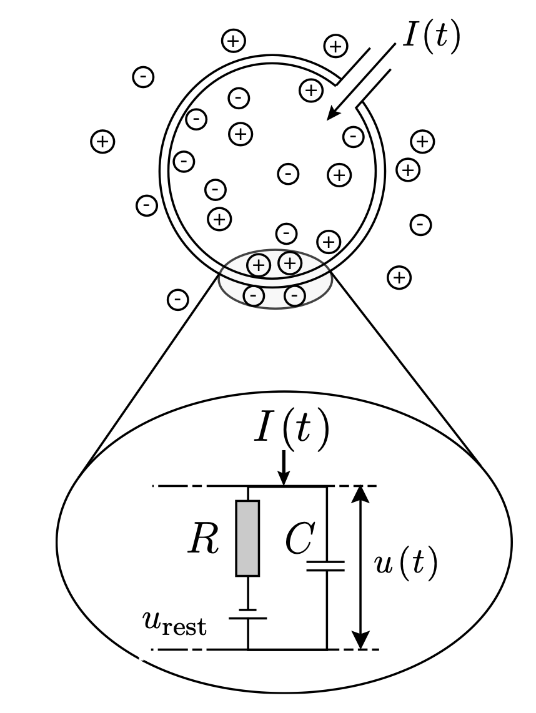
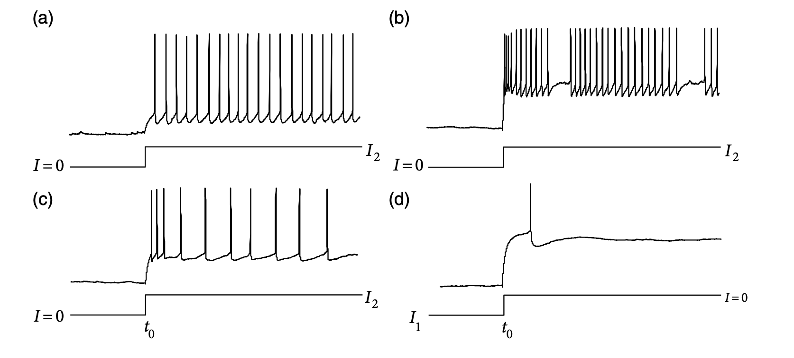

In recent years, Deep Learning has gained substantial success in various fields. With the emergence of powerful large models such as GPT-4o, we seem to be a big step towards Artificial General Intelligence (AGI). However, thought massive in size, current deep learning methods cannot handle tasks such as continual learning and logical thinking very well. So how to solve these problems? As we can see, human brains are very good at logical thinking and continual learning compared to machines, so it might be helpful if you can dive into the neuro system of the human brain to get some inspirations. To this end, I write this blog post to record some insightful contents from the classic *Neuronal Dynamics along with some of my thoughts.

## Chapter 1 Introduction

Here are some interesting numbers:
1. There are 86 billion neurons in the human neuro system, but only **16 billion** in the cerebral cortex. Interestingly, humans are not the animal with the most neurons in animals, orcas have roughly **43 billion neurons** in their fore brain, but they are not as smart as humans, which may suggest that **the structure of the brain** is also important for intelligence.
2. Every neuron connects to **$10^4$ postsynaptic neurons** on average. As we know, the weights of artificial neural networks (ANNs) actually store the synapse information between different layers of neurons, so in order to match the size of human brains, the ANNs will need to have almost **160 trillion** parameters, which is 100 times larger than the largest ANN model in the world (GPT-4).
3. The **resting potential** of neurons is about -65mV, when the menbrane potential is below this value, it's called **hyperpolarization** and when above, **depolarization**. The action potential or spike is about 100mV, and typically last for 1-2ms. It typycally requires 20-50 presynaptic spikes to trigger a postsynaptic spike. 

### The Integrate-and-Fire (IF) Model

The neuron can be simplified to an RC-circuit.

We can acquire the dynamics of this circuit with the following deductions:
$$I(t) = I_R + I_C = \frac{u(t) - u_{rest}}{R} + C\frac{du}{dt}.$$
$$\tau_m\frac{du}{dt} = - [u(t) - u_{rest}] + RI(t), \ \tau_m \approx 10ms.$$
The solution of the above differential equation with the initial condition $u(0) = u_{rest}$ is:
$$u(t) = u_{rest} + \frac{R}{\tau_m}\int_0^{\infty}\exp{(-\frac{s}{\tau_m})}I(t-s)ds.$$

When the membrane potential $u(t)$ reaches a thredhold value $\theta$, it will fire a spike and the membrane potential will drop to the rest potential $u_r$. The firing time of the neuron is denoted by 
$$t^f: u(t^f) = \theta, \ \lim_{\delta \rightarrow 0^+} u(t^f + \delta) = u_r.$$

If we consider the reset current, then the dynamics of the membrane potential becomes:
$$u(t) = u_{rest} + \sum_f (u_r - \theta)\exp{(-\frac{t-t^f}{\tau_m})} + \frac{R}{\tau_m}\int_0^{\infty}\exp{(-\frac{s}{\tau_m})}I(t-s)ds.$$

Tips: 
1. We can use Green function and convolution to solve linear differential equations.
2. We can use Fourier Transform to turn convolution into multiplication.

### The Limitations of IF Model
**1. Adaptation, bursting and inhibitory rebound**
    (a) Constant Spiking
    (b) Burst Firing
    (c) Adaptation
    (d) Inhibitory Rebound

(b) and (c) can be corrected by adding another linear filter in the model. 
**2. Shunting inhibition and reversal potential**
The postsynaptic current (PSC) generated by a spike scales with the quantity $[u(t) - E_{syn}]$, where $E_{syn}$ is called reversal potential. $E_{syn} \approx u_{rest}$, slightly smaller than $u_{rest}$ for **inhibitory** synapses, and $E_{syn} >> u_{rest}$ for **excitary** synapses. 
**3. Spatial Structure**
Sometimes if the spikes on a same branch of dendrites arrive too frequently, it will prolong the spike to **tens of milliseconds**.

### What can we say about IF model?
Of course, IF model is a very simple model of the neuron, which cannot represent all the characteristics of a neuron. But the question is, is such a model enough for generating all the intelligence that humans have? 
